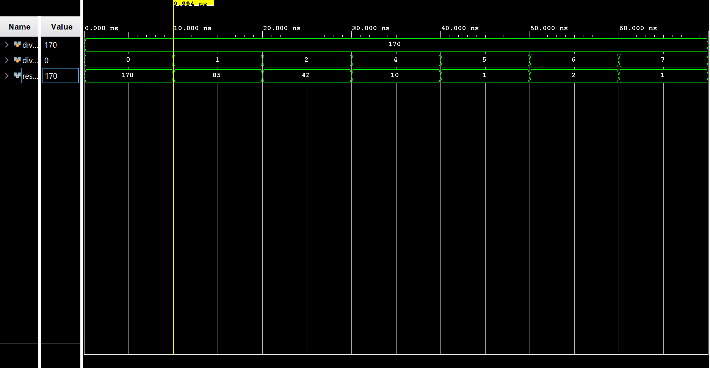

# Division by Powers of 2

This project implements an 8-bit division module where the input number is divided by powers of 2 (from 2⁰ to 2⁷). The result is a fixed-point value, generated using structural Verilog and multiplexers.

---

## Description

- **Input**:  
  - `A` (8-bit unsigned input)  
  - `shift_sel` (3-bit control signal, 0–7)

- **Output**:  
  - `Y` (8-bit result = A >> shift_sel)

The right shift divides the input by 2ⁿ, where `n = shift_sel`. The output represents the fixed-point result of this division.

---

## Design Details

- All modules are written in **structural Verilog**.
- Multiplexers are used to select from 8 precomputed right-shifted versions of the input.
- No arithmetic dividers are used — only combinational shift and mux logic.
- The design is optimized for synthesis and hardware implementation.

---

## Output Verification

- Simulated using **Vivado**.
- Outputs were verified against manually calculated binary results for each division case.

---

## Output Waveform

---

## Notes

- Output is interpreted as a fixed-point binary value.
- Future updates may include signed division and more accurate fractional representation.

